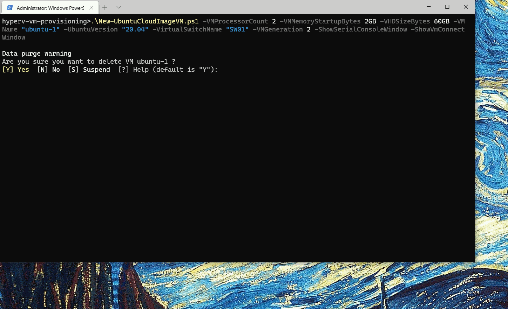

# Powershell scripts for fast Linux VM provisioning

## Features
- Provision Linux VM using cloud-init on Hyper-V in a single command
- Use custom userdata yaml, see [examples](https://cloudinit.readthedocs.io/en/latest/topics/examples.html)
- Using Ubuntu Cloud Images certified for Azure and proven to work reliably on Hyper-V (20.04 focal, 18.04 bionic)
  with [tailored Microsoft kernel](https://www.neowin.net/news/canonical--microsoft-make-azure-tailored-linux-kernel/) included
- Generation 1 for Azure migration friendliness or Generation 2 Hyper-V virtual machine type supported
- Automatic update check for a newer image on provisioning
- Works on Windows 10 and Hyper-V 2016

## Example usage
    .\New-UbuntuCloudImageVM.ps1 -VMProcessorCount 2 -VMMemoryStartupBytes 2GB -VHDSizeBytes 60GB -VMName "ubuntu-1" -UbuntuVersion "20.04" -VirtualSwitchName "SW01" -VMGeneration 2
Wait for image download and after starting VM some **20 minutes** for the first boot. Quite a time but cloud-init `DataSourceAzure` seems to wait that long for Azure IMDS reply before giving up and falling back to provising using provided userdata from CD drive.

Default username is `user` and password is `Passw0rd` (easily overriden with script parameters). Use standard parameters
as needed: unattended use `-Force`, get some additional details `-Verbose` or to make initial checkpoint for VM use `-Debug`.

You should provide your own custom `userdata.yaml` as script parameter and customize the final image.

## Troubleshooting
If you get error `ERROR Daemon /proc/net/route contains no routes` on serial
console then you need to check if your VM has got and IP address - that is
requirement for provisioning to finish. You need to reboot VM after adding IP
to finish with provisioning.

## Similar projects and credits
https://blogs.msdn.microsoft.com/virtual_pc_guy/2015/06/23/building-a-daily-ubuntu-image-for-hyper-v/

https://github.com/MicrosoftDocs/Virtualization-Documentation/blob/master/hyperv-samples/benarm-powershell/Ubuntu-VM-Build/BaseUbuntuBuild.ps1

https://github.com/fdcastel/Hyper-V-Automation/blob/master/New-VMFromUbuntuImage.ps1

https://gist.github.com/PulseBright/3a6fe586821a2ff84cd494eb897d3813

https://gist.github.com/matrey/66d697ef540f0da8933a341524ea9fd7

https://matrey.github.io/articles/build-your-own-ubuntu-ami/

## License
public domain  or any other license for reused work from original authors
